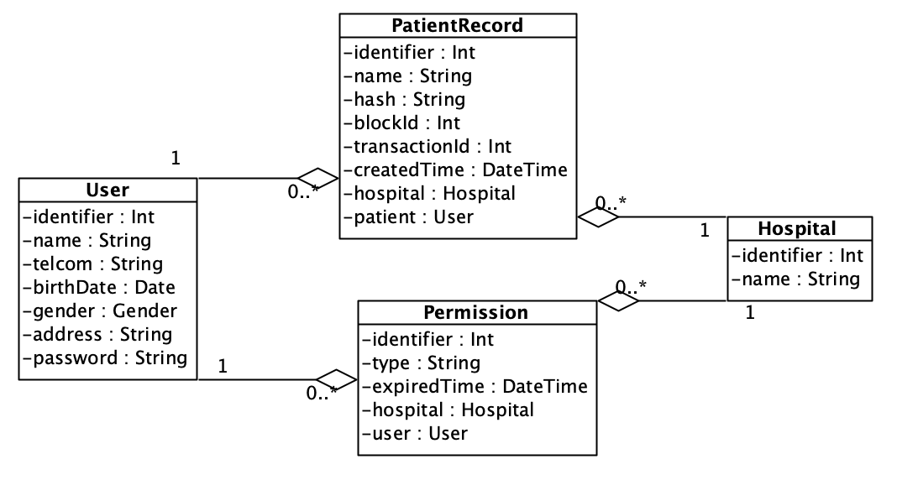
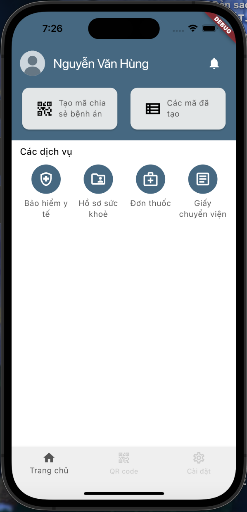
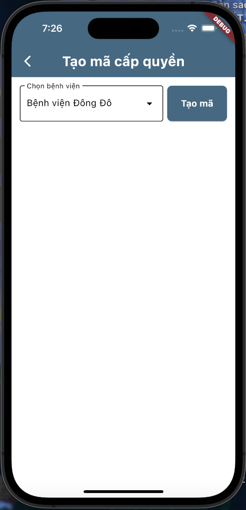
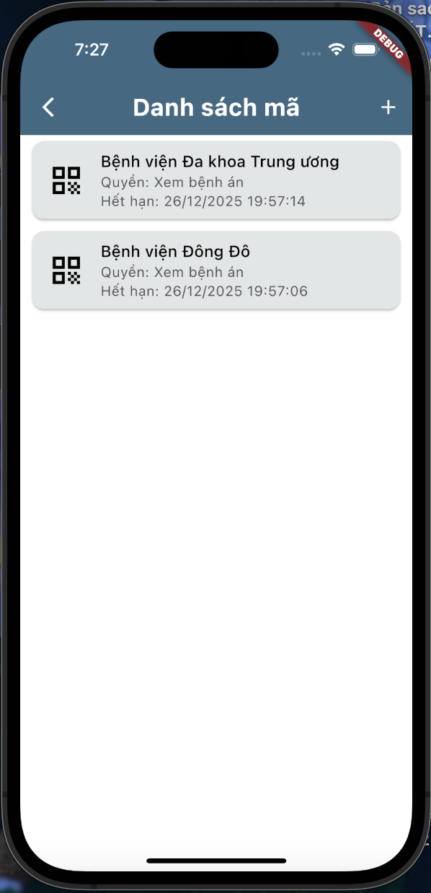
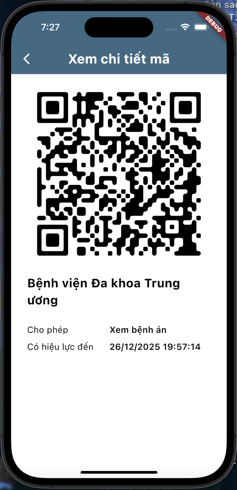

# inter_hospital_app

Đây là app cho hệ thống chung cho các bệnh viện. App gồm các tính năng: xem QR code thông tin cá nhân, xem bảo hiểm y tế, xem hồ sơ 
sức khoẻ (tất cả các bệnh án), xem tất cả đơn thuốc, xem giấy chuyển viện

## Công nghệ sử dụng
- Flutter 3.19.0
- Dart 3.3.0
- Pod 1.16.2

## Để bắt đầu

Dự án này được viết bằng Flutter, do đó để có thể build được cần cài đặt Flutter.

Cài đặt Flutter theo hướng dẫn: [Hướng dẫn](https://docs.flutter.dev/get-started/install) 

Dưới đây là một số nguồn tài liệu tham khảo:

- [Tài liệu chính thức](https://docs.flutter.dev/)
- [Lab: Write your first Flutter app](https://docs.flutter.dev/get-started/codelab)
- [Cookbook: Useful Flutter samples](https://docs.flutter.dev/cookbook)

---
## Sơ đồ lớp


## Cấu trúc thư mục

Sử dụng tổ chức code theo kiến trúc Clean Architecture kết hợp với MVVM, chia theo từng chức năng của app.

| Cấu trúc tổng quan                                | Cấu trúc layer trong mỗi tính năng                         |
|---------------------------------------------------|------------------------------------------------------------|
|  |  |

```text
├── .gitignore                      # Quy định file/thư mục bỏ qua khi commit Git
├── .metadata                      
├── README.md                       # Tài liệu mô tả project
├── analysis_options.yaml
├── android/                        # Code native Android (Gradle, AndroidManifest…)
├── devtools_options.yaml
├── ios/                            # Code native iOS (Xcode, Info.plist…)
├── lib/                            # Thư mục chính chứa source code Dart
│    ├── fakedata/                  # Dữ liệu giả để test (sẽ xoá khi có be)
│    ├── features/                  # Chia folder theo tính năng chính (theo clean architecture + MVVM)
│    │   ├── auth/                  # Tính năng Authentication (đăng nhập/đăng ký)
│    │   │   ├── data/              # Tầng data: tầng truy xuất và xử lý dữ liệu
│    │   │   │   ├── datasources/                    # Remote API + Local DB (Isar, SharedPref): dùng trong repositories impl
│    │   │   │   ├── models/                         # Chuyển đổi dữ liệu Data <-> Object <-> Entity: dùng trong datasources và repositories impl
│    │   │   │   └── repositories/                   # Repository implementation từ tầng domain (Nơi xử lý logic về dữ liệu)
│    │   │   ├── domain/            # Tầng domain: Business logic thuần (Tầng này sẽ đc gọi trong lớp presentation)
│    │   │   │   ├── entities/                       # Chứa Entity (Lớp chứa các trường cần trong việc gửi/nhận dữ liệu)
│    │   │   │   └── repositories/                   # Repository (interface)
│    │   │   └── presentation/      # Tầng UI (giao diện + state management)
│    │   │       ├── cubit/                          # Chứa cubit, state, event 
│    │   │       ├── view/                           # Các page chính (LoginPage, RegisterPage...)
│    │   │       └── widgets/                        # Các thành phần nhỏ của page chính
│    │   ├── create_code/           # Tính năng tạo mã (QR/Code…)
│    │   ├── home/                  # Màn hình trang chủ
│    │   ├── notification/          # Tính năng thông báo
│    │   ├── profile/               # Tính năng hồ sơ cá nhân
│    │   ├── setting/               # Cài đặt gồm: đổi mật khẩu, đổi sđt, thông báo, mode
│    │   ├── view_code/             # Xem danh sách mã QR/code còn hiệu lực
│    │   ├── view_followup_appointment/   # Xem lịch hẹn tái khám
│    │   ├── view_health_insurance/ # Xem bảo hiểm y tế
│    │   ├── view_medical_record/   # Xem hồ sơ bệnh án
│    │   ├── view_prescription/     # Xem đơn thuốc
│    │   └── view_transfer_letter/  # Xem giấy chuyển viện
│    ├── main.dart
│    ├── share/                     # Code dùng chung (core/shared)
│    │   ├── constants/             # Các hằng số (keys, strings…)
│    │   ├── dio/                   # Viết các lớp kết nối với api theo Singleton pattern
│    │   ├── db/                    # Viết các lớp kết nối với db theo Singleton pattern
│    │   ├── navigation/            # Quản lý route/navigation
│    │   ├── themes/                # Định nghĩa theme (màu sắc, typography…)
│    │   ├── types/                 # Định nghĩa kiểu dữ liệu (enums, typedef…)
│    │   ├── utils/                 # Hàm tiện ích, helper function
│    │   └── widgets/               # Widget tái sử dụng toàn app
│    └── splash_screen.dart         # Màn hình khởi động app
├── linux/         # Code native cho Linux desktop
├── macos/         # Code native cho macOS desktop
├── web/           # Code hỗ trợ chạy trên Web
└── windows/       # Code native cho Windows desktop
```
## Nhánh build
Các bước thực hiện triển khai:
- Bước 1: Lấy toàn bộ mã nguồn của repo GitHub vào môi trường runner
- Bước 2: Cài Flutter SDK
- Bước 3: Cài đặt các thư viện phụ thuộc (dependency) cho dự án
- Bước 4: Tạo lại file firebase_options.dart từ GitHub Secrets
- Bước 5: Phân tích code (hiển thị warning nhưng ko dừng)
- Bước 6: Chạy testcase (nếu có)
- Bước 7: Build file APK
- Bước 8: Lưu file APK ra artifacts để tải về và gửi link tải app đến email tài khoản test đã đăng ký.

## Sơ đồ triển khai
 

## Kết quả sau khi chạy
| Trang chủ                                    | Tạo mã cấp quyền                             | Danh sách mã                                 | Mã chi tiết                                  |
|----------------------------------------------|----------------------------------------------|----------------------------------------------|----------------------------------------------|
|  |  |  |  |

---
## Cách chạy project

- Clone source code
```shell
git clone https://github.com/chuthimai/hospital_app.git
```
- Cài đặt dependencies
```shell
flutter pub get
```
- Cấu hình Firebase
```shell
# cai dat
curl -sL https://firebase.tools | bash 

# dang nhap
firebase login 

# ds cac project dc luu
firebase projects:list 

# Cài đặt FlutterFire CLI bằng cách chạy lệnh sau từ bất kỳ thư mục nào
dart pub global activate flutterfire_cli 
```
